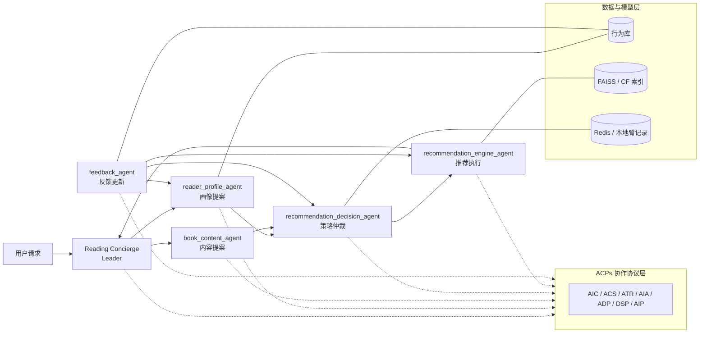
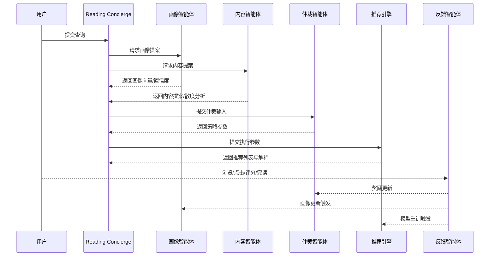

# 第三章 基于ACPs的图书推荐系统设计与实现

## 3.1 引言

图书推荐系统在实际应用中不仅需要根据用户历史行为生成相关结果，还需要同时处理冷启动、语义理解、多样性控制、解释生成和反馈更新等多个约束条件。尤其在数字阅读场景下，书目文本信息丰富、用户兴趣变化缓慢且反馈周期较长，使推荐过程既要关注内容语义，又要兼顾行为信号和在线更新能力。

现有主流图书推荐方法主要包括协同过滤、基于内容的推荐和混合推荐三类。协同过滤擅长利用群体行为发现隐式兴趣，但容易受到冷启动和数据稀疏影响；基于内容的推荐能够利用标题、简介和题材标签建立语义关联，但容易导致推荐结果过于集中；静态混合推荐虽然能够综合多种信息源，却通常依赖固定权重或预设规则，难以根据用户状态、请求上下文和反馈历史动态调整推荐策略。

此类方法存在两个局限。首先，现有推荐链路大多仍以单体排序模型为中心，用户画像、内容理解、策略决策和解释生成之间缺少清晰分工，导致复杂场景下的可扩展性和可调试性不足。其次，即使引入多智能体工作流，如果缺少统一协议和反馈闭环，不同模块之间的状态同步、能力复用和长期演化也较难稳定实现。

为应对上述挑战，本章提出一种基于 ACPs 的协议化多智能体图书推荐方法。该方法将用户行为建模与内容语义分析拆分为两个并行提案过程，并引入基于上下文赌博机的仲裁机制替代静态融合权重，同时通过反馈智能体把用户行为持续回流至画像、仲裁和执行层，形成可在线演化的闭环推荐链路。与现有多智能体推荐工作相比，本文方法不只强调任务分工，更强调在统一协议下的稳定交互、状态流转与长期更新能力。

本章首先介绍系统总体架构和运行链路，然后分别说明读者画像提案智能体、书目内容提案智能体、推荐决策仲裁智能体、推荐引擎执行智能体与反馈闭环的设计与实现。需要说明的是，推荐引擎执行智能体作为执行层伙伴，内部仅保留召回、排序和解释三个功能模块，而不再继续拆分为独立协议智能体，从而在保持协作边界清晰的同时降低执行层通信开销。

## 3.2 系统总体架构

与第二章中的协同过滤、内容推荐和静态混合推荐不同，本文系统不再将推荐过程视为单一打分问题，而是设计为“请求理解—并行提案—仲裁决策—执行推荐—反馈更新”的协作链路。系统以 Reading Concierge 作为唯一的 Leader，以读者画像提案智能体、书目内容提案智能体、推荐决策仲裁智能体、推荐引擎执行智能体和反馈智能体作为专门化 Partner。Leader 负责接收用户查询并组织多智能体协作，Partner 则分别承担画像建模、内容分析、策略仲裁、推荐执行与反馈更新任务。

从协议层看，系统的协作边界由 ACPs 的注册、发现、认证、同步与交互机制构成[10,11]。每个智能体通过 ACS 描述自身能力，通过 AIC 维持唯一身份，通过 AIA 和 ATR 完成可信通信和注册，通过 ADP 发现可用伙伴，通过 DSP 保持注册信息同步，通过 AIP 传递任务和结果。由此，系统在协作层面实现了比传统硬编码调用链更清晰的职责划分和更稳定的扩展边界。

系统的核心执行顺序如下：Leader 首先解析用户请求并提取结构化意图；随后并行调度读者画像提案智能体和书目内容提案智能体；再将两侧提案提交给推荐决策仲裁智能体；仲裁结果生成后，由推荐引擎执行智能体完成候选召回、初排、重排和解释生成；最终由 Leader 统一组装返回结果，并将会话上下文写入会话存储。与此同时，反馈智能体会在用户浏览、点击、评分、完读和跳过等事件发生后，将奖励信号回流至仲裁层、画像层和执行层，形成闭环更新。

图 3-1 展示了系统总体架构，图 3-2 展示了从用户请求到推荐结果返回的协作时序。



图3-1 系统总体架构图



图3-2 协作时序图

如图 3-1 所示，系统在静态结构上由 Leader、五类 Partner、ACPs 协议层和数据模型层共同构成；其中协议层并不直接参与推荐计算，而是为各智能体提供统一的身份、发现和交互边界。如图 3-2 所示，系统在动态流程上遵循”并行提案—集中仲裁—统一执行—反馈回流”的顺序，该顺序也是本文相较于传统静态混合推荐的核心改进所在。

## 3.3 读者画像提案智能体设计与实现

读者画像提案智能体负责从历史行为序列中抽取稳定偏好特征，并输出画像向量、置信度、题材偏好和策略建议。与第二章中的纯协同过滤基线相比，该智能体不再直接围绕用户—物品交互矩阵学习静态隐向量，而是显式建模行为时序、题材偏好和冷启动状态，从而把稀疏行为信号转化为可供仲裁智能体使用的结构化提案[22,24]。

### 3.3.1 行为序列衰减建模

该智能体从用户行为库中加载近 90 天的行为记录，对每条行为事件按时间衰减进行加权，衰减系数由配置项 `LAMBDA = 0.05` 控制（实验中具体参数见第四章表4-3）。越近的行为对画像贡献越大，从而降低过时兴趣对推荐结果的干扰。

具体而言，若某条事件的时间间隔为 \( \Delta t \)，则其有效权重可写为：

$$
s_e = \max(w_e, r_e, 0.1)\exp(-\lambda \Delta t) \tag{3-1}
$$

其中 \( w_e \) 为事件基础权重，\( r_e \) 为评分信号，\( \lambda \) 为时间衰减系数，0.1 为最小权重下界，用于防止权重退化为零，保证低评分事件仍对画像有最小贡献。系统随后按以下三个步骤完成画像构建：1. 将书目标识、事件类型以及二者的联合特征映射到 256 维哈希空间；2. 按 0.50、0.30 和 0.20 的权重分别累加三类特征贡献，其中书目标识的区分度最高，联合特征次之，事件类型最低；3. 对累加结果执行 \( \ell_2 \) 归一化，得到稳定的画像向量。这样的做法兼顾了稀疏性下的鲁棒性和向量空间下的可比性。

### 3.3.2 低样本题材语义归纳

当行为样本较少时，仅靠频次统计往往难以捕捉读者的潜在偏好，因此该智能体引入 LLM 进行题材语义归纳。系统会先从事件中提取流派标签；若可观察到的题材种类较少，或者行为序列过短，则调用外部 LLM 对最近行为摘要进行归纳，输出 `latent_genres` 作为补充偏好。

该设计与传统推荐系统中的“行为统计优先、语义归纳兜底”策略一致：当显式信号足够充分时，直接采用统计结果；当信号稀疏或分布过窄时，再通过 LLM 提升偏好抽象能力。若 LLM 返回无效 JSON，系统会自动回退到基于 baseline 的保守题材列表，避免画像构建失败影响后续协商。

### 3.3.3 画像向量与置信度生成

画像智能体在输出内容上采用“向量 + 置信度 + 冷启动判断 + 策略建议”的组合形式。置信度由行为数量与阈值共同决定，默认 warm 阈值为 20；当事件数少于 5 条时，系统将用户视为冷启动，并将置信度上限压低到 0.25。策略建议则简单区分为 `explore` 与 `exploit`：冷启动用户倾向探索，稳定用户倾向利用。

除主提案外，该智能体还支持两类补充接口：一是接收仲裁智能体发出的证据请求，返回人口统计先验和修正后的置信度；二是接收反馈智能体触发的增量更新，重新生成画像并返回更新后的画像向量。因此，画像智能体不仅承担初始建模，还承担后续持续更新的职责[22,24]。

读者画像提案智能体的核心流程如算法 3-1 所示。

算法 3-1 读者画像提案生成流程

```text
输入:  用户近 90 天行为序列 \( \mathcal{E} \)
       时间衰减系数 \( \lambda \)
       暖启动阈值 \( T_w \)

输出:  画像向量 \( \mathbf{p}_u \)
       置信度 \( c_u \)
       题材偏好集合 \( G_u \)
       策略建议

// 行为加权
按式(3-1)计算各行为事件的有效权重

// 特征映射与累加
将书目标识、事件类型和联合特征映射到统一哈希空间
按预设权重累加三类特征，并执行 \( \ell_2 \) 归一化

// 低样本补全
若样本不足，则调用语义归纳模块补全潜在题材偏好

// 提案输出
根据事件数和阈值计算置信度，并输出探索/利用建议
```

## 3.4 书目内容提案智能体设计与实现

书目内容提案智能体负责将书目信息映射到内容语义空间，并计算用户偏好与书目内容之间的对齐关系。与第二章中的纯内容推荐基线相比，该模块并不直接以内容相似度作为最终排序结果，而是先生成可供仲裁的内容提案，再与画像提案共同决定后续执行策略[28-31]。

### 3.4.1 文本嵌入与投影表示

在输入侧，该智能体会先对候选书目进行规范化，统一补全 `book_id`、`title`、`author`、`description` 和 `genres` 等字段；随后将书名、题材和简介拼接为文本输入，使用 `all-MiniLM-L6-v2` 生成 384 维句向量。为了与系统其他模块保持统一，该向量再通过 256×384 的投影矩阵映射到 256 维用户空间。投影矩阵通过主成分分析（PCA）在训练集上学习得到，在系统运行期间保持固定。

这种设计的优势在于：一方面保留了预训练编码器对长文本语义的表达能力，另一方面通过投影矩阵压缩维度，使内容向量与画像向量处于同一协商空间，便于后续计算偏好散度和权重建议[26,27]。

### 3.4.2 偏好对齐与散度分析

内容智能体会同时读取用户显式声明的题材偏好和行为流派分布，并计算二者的 Jensen-Shannon 散度。若散度较低，则说明用户声明与历史行为保持一致；若散度超过阈值，则系统认为当前请求存在偏好偏移或信息不足，需要提高探索比例。配置文件中默认的散度阈值为 0.4。其定义可写为：

$$
\operatorname{JSD}(P \| Q) = \frac{1}{2}D_{\mathrm{KL}}(P \| M) + \frac{1}{2}D_{\mathrm{KL}}(Q \| M), \quad M = \frac{P+Q}{2} \tag{3-2}
$$

其中 \( P \) 和 \( Q \) 分别表示用户显式偏好分布与行为流派分布，\( M \) 表示两者的平均分布，\( D_{\mathrm{KL}} \) 表示 Kullback-Leibler 散度。JSD 越大，说明用户当前声明与历史偏好偏离越明显。基于散度结果，智能体会生成权重建议和覆盖报告：前者给出画像权重和内容权重的建议值，后者统计候选书目的描述完整度和题材覆盖情况。当散度过大时，系统还会主动发出反提案，建议采用更偏探索的策略，并提高多样性重排权重。这样，书目内容提案不只是“给出分数”，而是“给出可仲裁的策略主张”。

### 3.4.3 反提案与补充提案机制

当推荐决策仲裁智能体认为证据不足时，会向内容智能体发出补充提案请求。此时内容智能体会返回 `fallback_strategy` 和 `exploration_budget`，用于支持后续的保守或探索型推荐。换言之，内容智能体同时承担“主动反提案”和“被动补证据”两种角色：前者用于表达对偏好偏移的判断，后者用于在仲裁阶段提供更充分的决策依据。

这一设计的关键意义在于，它将内容对齐从静态过滤变成了动态协商。系统并不假定书目内容总是应当迎合用户既有偏好，而是在必要时主动提出探索方案，以缓解过度专业化和信息茧房问题[14]。

## 3.5 推荐决策仲裁智能体设计与实现

推荐决策仲裁智能体是本文系统中的中立协调者。与第二章中的静态混合推荐相比，该模块不再预设固定融合权重，而是接收画像提案和内容提案后先进行质量门控，再基于上下文赌博机策略选择推荐方案，最后输出可供执行层使用的权重组合与策略参数[35,36]。

### 3.5.1 质量门控与证据请求

仲裁智能体首先检查两侧提案的质量。若画像置信度过低，则向读者画像智能体请求补充先验；若内容提案缺少权重建议或覆盖报告，则向书目内容智能体请求补充证据；若画像与内容之间出现极端不一致，则同时向双方发起证据请求。对于冷启动情形，系统允许最多两轮补证据；对于常规情形，则默认一轮仲裁即可完成。

这一机制保证了仲裁不是简单地在两个分数之间取平均，而是带有显式的质量门控和条件重新招标过程。换言之，系统对“输入不充分”的场景采取的是协商而非硬裁决。

### 3.5.2 上下文赌博机仲裁策略

仲裁智能体将当前场景划分为 `high_conf / low_conf` 与 `high_div / low_div` 两个维度，并据此构造上下文类型。系统预定义五类动作臂：`profile_dominant`、`balanced`、`content_dominant`、`explore` 和 `conservative`。在各臂试验次数不足 20 次时，系统采用规则化启发式策略；当各臂有足够历史记录后，再切换为上下文 UCB 风格的臂选择方式[35,36]。

本文使用的上下文 UCB 变体可写为：

$$
a_z^* = \arg\max_a \left[\hat{\mu}_{a,z} + c\sqrt{\frac{\ln N_z}{N_{a,z}}}\right] \tag{3-3}
$$

其中 \( z \) 为上下文类型，\( N_z \) 为该上下文下总试验次数，\( N_{a,z} \) 为动作臂 \( a \) 在上下文 \( z \) 下的被选次数，\( \hat{\mu}_{a,z} \) 为对应上下文下的平均奖励，\( c \) 为探索系数。该公式表明，仲裁智能体会同时考虑历史平均收益和当前不确定性，从而在利用高收益策略与探索潜在更优策略之间保持平衡。

根据不同动作臂，仲裁智能体会输出对应的向量召回权重、协同过滤权重、综合排序权重和多样性参数。例如，画像主导臂更强调用户历史先验，内容主导臂更强调探索和多样性，而平衡臂则在两者之间取折中。该设计使推荐策略能够随上下文和反馈历史动态演化，而不必固化为单一参数模板。

推荐决策仲裁智能体的核心流程如算法 3-2 所示。

算法 3-2 上下文仲裁流程

```text
输入:  画像提案 \( \Pi_p \)
       内容提案 \( \Pi_c \)
       上下文状态 \( z \)

输出:  动作臂 \( a_z^* \)
       排序权重
       多样性参数

// 质量门控
检查画像置信度、覆盖报告和散度信息

// 证据补充
若证据不足，则向相关提案智能体发起补充请求

// 策略选择
若各臂试验次数不足阈值，则采用启发式规则选臂
否则按式(3-3)计算各动作臂得分并选择最优臂

// 参数输出
输出召回权重、排序权重和多样性控制参数
```

### 3.5.3 奖励更新与臂记录维护

仲裁智能体的臂记录以试验次数和平均奖励两个字段表示，并在每次奖励更新后同步写入持久化存储。反馈智能体在会话结束后向仲裁智能体发送奖励信息，仲裁智能体据此更新当前上下文与动作臂的累计试验次数和平均奖励。该机制实现了“决策—反馈—再决策”的在线学习闭环，使仲裁策略能够随着系统运行逐步收敛。

由于奖励更新与动作选择采用同一上下文键管理，系统可以在不同偏好状态下分别维护臂的收益分布，从而避免把冷启动、强偏好和高散度场景混合在同一个统计桶中[35,36]。

## 3.6 推荐引擎执行智能体与反馈闭环设计

推荐引擎执行智能体负责把仲裁结果转化为最终推荐列表。与第二章中的单阶段排序方法不同，该模块将推荐执行细化为召回、排序和解释三个内部模块，并在同一进程内以函数调用方式协作，而不是再次通过 ACPs 协议通信。这样的设计降低了执行层通信开销，也使候选处理、重排和解释能够共享同一批中间特征。

### 3.6.1 候选召回与内容排序流水线

在召回阶段，系统同时使用语义召回和协同过滤召回，两路结果合并为候选池后再交由排序模块处理。若请求中显式携带候选向量，则执行层也可直接使用预先整理好的候选信息；但在标准路径下，领导者会优先通过查询语义和用户画像完成候选检索。

排序模块采用四维打分函数，将内容相似度、协同过滤得分、新颖性和时效性组合为初排分数。系统在冷启动状态下会减弱协同过滤权重，并提高内容相似度的重要性；在稳定状态下，则恢复内容和协同过滤的平衡融合。该设计与第二章的混合推荐思想保持一致，但实现上更强调“仲裁输出参数驱动排序”的端到端协作方式。

四维打分函数可表示为：

$$
\text{score}_i = \alpha_1 s_{\text{sem}} + \alpha_2 s_{\text{cf}} + \alpha_3 s_{\text{novel}} + \alpha_4 s_{\text{time}} \tag{3-4}
$$

其中 \( s_{\text{sem}} \) 表示语义相似度得分，\( s_{\text{cf}} \) 表示协同过滤得分，\( s_{\text{novel}} \) 表示新颖性得分，\( s_{\text{time}} \) 表示时效性得分，\( \alpha_k \) 为仲裁智能体输出的动态权重，并满足 \( \sum_k \alpha_k = 1 \)。该式说明，执行层并不采用固定融合权重，而是根据上游仲裁结果自适应调整不同信号的贡献比例。

### 3.6.2 MMR 重排与解释生成

在初排之后，系统会进一步使用 MMR 进行多样性重排。MMR 的作用不是替代相关性排序，而是在保持相关性的前提下减少列表内部同质化。执行层的 `rerank_round2` 会先根据仲裁智能体输出的置信阈值和惩罚系数对候选项做置信惩罚，再使用 MMR 进行贪心式选择。若仲裁结果更偏探索，则 `mmr_lambda` 取值更小（增强多样性）；若更偏画像利用，则 `mmr_lambda` 取值更大（增强相关性）[30]。

解释生成由内部解释模块完成。系统会先依据内容相似度、协同过滤邻居、题材匹配和书目元数据特征计算解释置信度，再调用 LLM 生成个性化推荐理由；若关键元数据缺失，则会通过模板化补全逻辑生成兜底解释。该设计使执行层不仅输出推荐列表，也能输出与排序依据一致的解释信息。

### 3.6.3 行为反馈触发与模型重训

反馈智能体是系统闭环的入口。它接收浏览、点击、完读、评分和跳过等行为事件，将事件映射为标准化奖励，并驱动后续的画像更新、仲裁更新和模型重训。

行为类型与奖励信号的映射关系如下。

| 行为类型 | 奖励值 | 信号强度 |
|---|---:|---|
| 完读 | 1.0 | 最强正信号 |
| 评分 ≥ 4 | 0.8 | 强正信号 |
| 点击 | 0.3 | 弱正信号 |
| 浏览 | 0.1 | 极弱信号 |
| 跳过 | -0.2 | 负信号 |

每次推荐会话结束后，反馈智能体会向仲裁智能体发送奖励信号；当单用户累计事件达到阈值时，会触发读者画像智能体更新；当全局评分事件达到阈值时，会触发推荐引擎执行智能体的协同过滤重训脚本。

在 Leader 侧，通过标准化接口把前端传入的反馈信息转交给反馈智能体；在反馈智能体内部，奖励更新、用户计数和全局评分计数分别对应不同的触发条件。由此，系统形成了“用户行为采集—奖励映射—仲裁更新—画像更新—协同过滤重训”的闭环链路，使推荐策略能够随真实反馈持续演化。

推荐执行与反馈闭环的核心流程如算法 3-3 所示。

算法 3-3 推荐执行与反馈闭环流程

```text
输入:  仲裁结果 \( \Pi_a \)
       候选集合 \( \mathcal{C} \)
       用户反馈事件 \( \mathcal{F} \)

输出:  推荐列表
       解释结果
       更新后的奖励记录

// 候选生成
基于语义召回和协同过滤召回生成候选池

// 排序与重排
按式(3-4)计算初排分数，并输出 Top-\( K \) 候选
结合 MMR 完成多样性重排，并生成推荐解释

// 反馈回流
接收浏览、点击、评分和完读等反馈事件
将反馈映射为奖励，并触发仲裁更新、画像更新和重训
```

## 3.7 系统实现要点

### 3.7.1 技术栈与运行环境

本文系统采用 FastAPI 作为各智能体的服务框架，使用 `httpx` 完成跨智能体 RPC 调用，使用 Pydantic 进行请求与响应建模。Leader 侧由统一编排模块组织协作流程，Partner 侧则分别提供 AIP 处理入口。配置层主要由运行配置文件、能力描述文件和环境变量共同决定，其中运行配置负责端口、模型参数、召回索引和阈值，能力描述文件负责协议身份、能力声明和端点信息。

本节主要概述技术栈与配置组织方式，部署模式、调试链路和联调用法已在第四章实验环境中统一说明。

### 3.7.2 关键配置参数与降级策略

系统的关键配置参数主要包括四类：第一类是画像和反馈阈值，例如读者画像的 `WARM_THRESHOLD = 20`、冷启动上限以及反馈智能体的 `USER_UPDATE_THRESHOLD = 20` 和 `CF_RETRAIN_THRESHOLD = 500`；第二类是仲裁参数，例如 `UCB_C = 1.0`、最大轮数和置信度门限；第三类是排序参数，例如 `DEFAULT_MMR_LAMBDA = 0.5`、`CONFIDENCE_PENALTY_THRESHOLD = 0.6` 和 `PENALTY_MULTIPLIER = 0.7`；第四类是召回参数，例如 `FAISS_INDEX_PATH`、`ALS_MODEL_PATH` 和候选集上限。具体实验参数配置详见第四章表4-3。

为了保证系统在真实部署中具有可用性，各模块都实现了明确的降级策略。画像智能体在 LLM 不可用或 JSON 解析失败时，会回退到基于 baseline 的保守题材列表；内容智能体在投影矩阵缺失时会继续使用 384 维句向量；仲裁智能体在 Redis 不可用时会改用本地 JSON 维护臂记录；推荐引擎在元数据不完整时会启用解释补全逻辑；反馈智能体在外部 webhook 不可达时会回退到本地调用链。

### 3.7.3 协议层工程实现

在协议层工程实现上，所有 Partner 都通过 ACS 描述其身份标识、端点、技能和安全配置，并注册到各自的 FastAPI 应用。Leader 的能力描述文件声明其职责为协调中枢，不直接参与仲裁和执行；画像、内容、仲裁、执行和反馈五个 Partner 则分别暴露画像构建、内容提案、策略仲裁、推荐执行和反馈处理等技能。

任务流转采用 AIP 的 `start / continue / cancel / inform` 语义实现。Leader 在编排阶段构造标准化 JSONRPC 消息，并通过本地或远程方式调用 Partner；Partner 收到消息后由 `TaskManager` 管理状态，执行完成后将结果打包为 `StructuredDataItem` 和 `TextDataItem` 返回。对于反馈触发这类异步通知，系统还支持 `on_message` 和 `inform` 语义，使奖励信号能够无须显式请求也能进入协作链路。

## 3.8 本章小结

本章结合 ACPs-app 的实际实现，系统说明了本文图书推荐系统的设计与协作机制。系统以 Reading Concierge 为唯一 Leader，以五个专门化 Partner 完成画像建模、内容对齐、策略仲裁、推荐执行和反馈更新，并通过 ACPs 协议实现统一注册、发现、认证、同步和交互[10,11]。

在具体实现上，读者画像智能体基于行为衰减和 LLM 语义归纳构建画像向量；书目内容智能体基于文本嵌入、投影和散度分析生成内容提案；推荐决策智能体通过质量门控与上下文赌博机完成仲裁；推荐引擎执行智能体在召回、排序和解释三个模块内形成闭环；反馈智能体则把真实行为持续反馈到各层，从而使系统具备在线演化能力。

本章的设计说明表明，本文系统并不是将多个模型简单拼接，而是通过协议化协作把各模块组织为可解释、可扩展、可持续更新的推荐框架。下一章将通过对比实验、消融实验和系统功能验证，进一步评估该框架的推荐效果与系统有效性。
